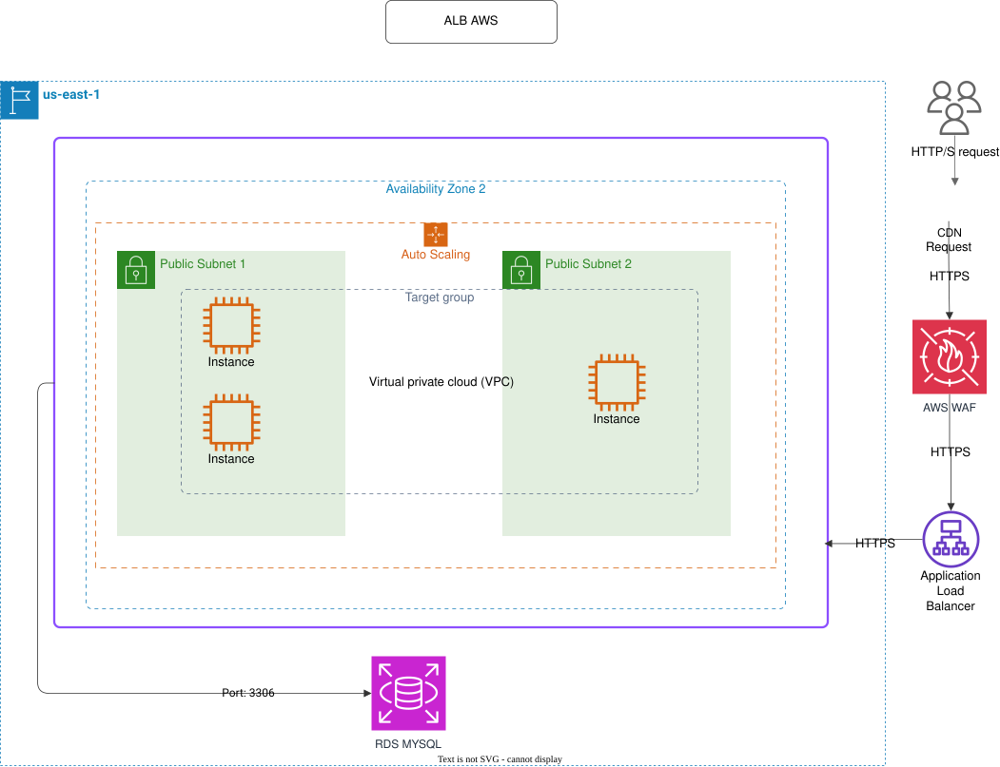

# Balanceador de Carga de Aplicaciones (ALB)

Este directorio contiene un diagrama que ilustra la arquitectura de un Balanceador de Carga de Aplicaciones (ALB).

## Diagrama

## Visión General
Este diagrama detalla cómo un Balanceador de Carga de Aplicaciones (ALB) actúa como punto de entrada para distribuir el tráfico entrante de manera eficiente y segura entre múltiples destinos.

## Componentes Clave
- **Balanceador de Carga (ALB)**: Gestiona la entrada de tráfico a nivel de capa 7 (HTTP/HTTPS) y aplica reglas de enrutamiento.
- **Grupos de Destino (Target Groups)**: Grupos de recursos (instancias, contenedores, funciones) que reciben el tráfico balanceado.
- **Listeners**: Configurados para verificar las conexiones de los clientes en puertos específicos.

## Funcionamiento
El diseño refleja:
- **Alta Disponibilidad**: Distribución inteligente del tráfico para evitar sobrecarga en destinos individuales.
- **Seguridad**: Terminación SSL/TLS centralizada y reglas de seguridad.
- **Flexibilidad**: Capacidad de enrutamiento basado en contenido (rutas de URL, cabeceras, etc.).

## Archivos
- `ApplicationLoadBalancer.drawio`: El archivo fuente de Draw.io.
- `ApplicationLoadBalancer.drawio.svg`: Versión exportada en SVG para visualización rápida.
