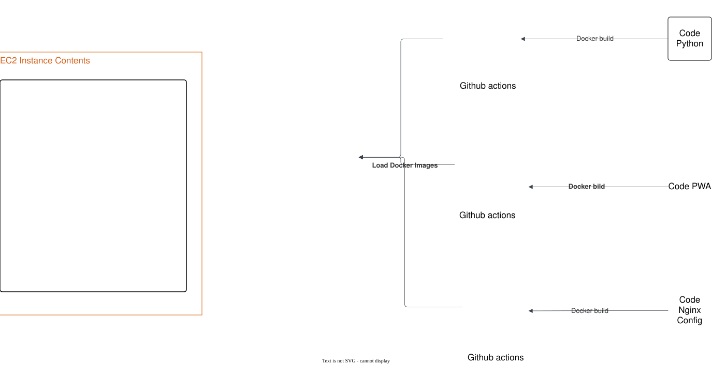

# Diagrama de Docker Swarm

Este directorio contiene un diagrama que ilustra la arquitectura de Docker Swarm.

## Diagrama

## Arquitectura y Flujo

El diagrama ilustra un flujo de CI/CD para una aplicación desplegada en un clúster de Docker Swarm. Los pasos principales son:

1. **Desarrollo y Versionado**: Los cambios en el código (`Python Code` o `PWA Code`) se envían mediante un `Commit`.
2. **Revisión**: Se gestionan las actualizaciones a través de `Pull Requests` que son posteriormente aprobadas y fusionadas (`Merge Pull Request`).
3. **Automatización**: Una herramienta de automatización, en este caso `N8N`, detecta el cambio mediante un `Webhook`.
4. **Orquestación**: `N8N` actúa sobre el `Manager Node` para coordinar el despliegue de las nuevas imágenes de contenedor en los `Worker Nodes` del clúster de Docker Swarm.
