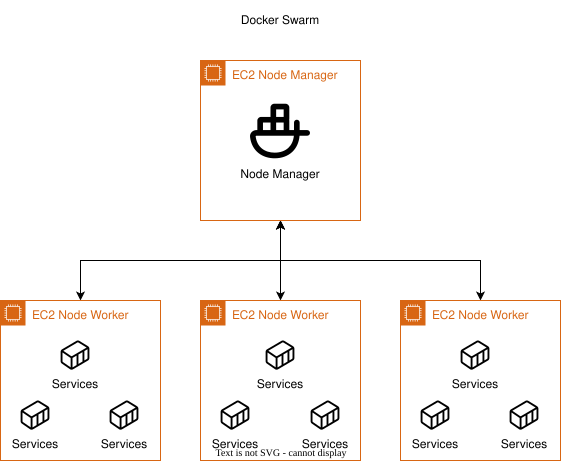

# Arquitectura de Docker Swarm

Este directorio contiene diagramas de arquitectura para un despliegue de Docker Swarm.

## Diagrama de Arquitectura

## Archivos

- `DockerSwarm.drawio`: El archivo fuente de Draw.io para el diagrama de arquitectura.
- `DockerSwarm.drawio.svg`: Una versión exportada en SVG del diagrama de arquitectura para visualización rápida.

---
*Esta documentación es parte de la colección de diagramas de arquitectura.*
